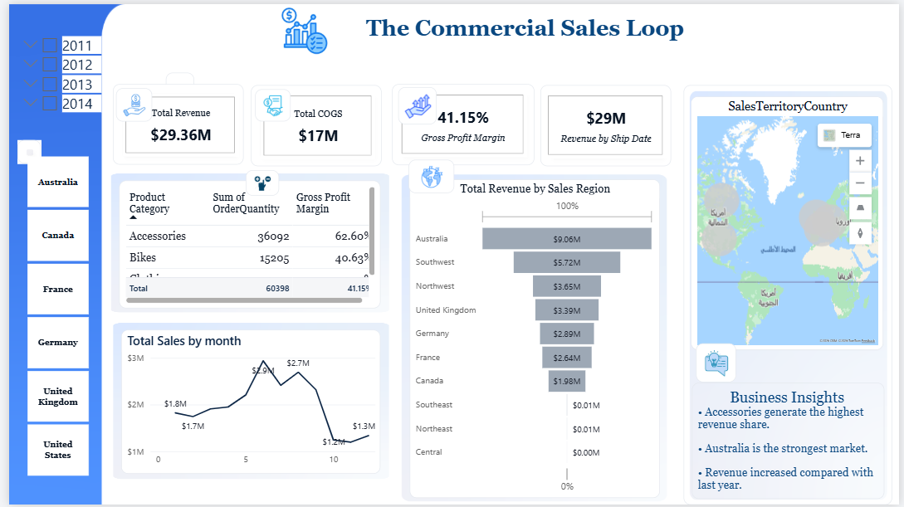
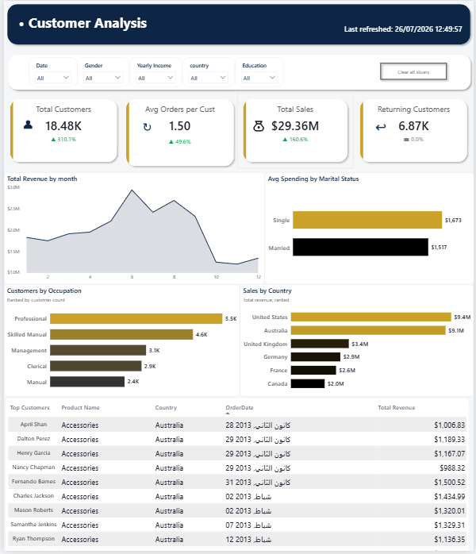

# Enterprise Operations Analytics | Power BI

Enterprise Operations Analytics is a Power BI case study built with Adventure Works training data. It shows how a reusable semantic model can turn sales, customer, workforce, and inventory data into a reporting experience that supports commercial and operational decisions.

## The business question

Revenue alone does not explain whether growth is healthy. A decision-maker needs to see revenue, cost, margin, product mix, regional performance, customer engagement, and workforce context in the same analytical environment.

This project answers that need through one report with four connected perspectives:

- **Commercial Sales:** revenue, COGS, gross margin, product mix, and regional performance.
- **Customer Analysis:** customer reach, order frequency, repeat customers, segmentation, and geography.
- **HR Analysis Dashboard:** employee count, tenure, job group, gender, and hiring trend.
- **Supply Chain & Inventory:** stock balance, units in, units out, inventory value, and category movement.

The public narrative focuses on the Commercial Sales and Customer Analysis pages because they provide the clearest decision story; the PBIX contains the complete four-page report.

## How the solution was built

The data was prepared in Power Query and organized as a star-schema-oriented model. Date, customer, product, and sales-territory dimensions filter the Internet Sales fact table, while product and date dimensions support inventory analysis. HR tables provide the workforce perspective. DAX measures then turn these model relationships into filter-aware KPIs rather than disconnected visual totals.

The report is designed to move from an executive question to an explanation: first identify where revenue and margin are moving, then isolate the product or region behind the result, and finally explore the customer context that can inform retention or commercial action.

## Measures that drive the analysis

| Measure | Why it matters |
|---|---|
| `Total Revenue` | Establishes the commercial baseline in the active filter context. |
| `Total COGS` | Shows the cost required to generate that revenue. |
| `Gross Profit Margin` | Separates profitable growth from volume without margin. |
| `YoY Revenue Growth %` | Places current revenue in a prior-year context. |
| `Total Customers` | Measures reach using distinct customers. |
| `Avg Orders per Customer` | Indicates purchase frequency and engagement. |
| `Returning Customers` | Highlights repeat-purchase behavior. |
| `Avg Spending` | Compares customer value across segments. |

The full measure catalog and process explanation are available in [`docs/measure-catalog.md`](docs/measure-catalog.md) and [`docs/data-model-and-process.md`](docs/data-model-and-process.md).

## Dashboard preview

The portfolio showcase highlights the two clearest decision views. The downloadable PBIX includes all four report pages.

### Commercial Sales Loop

### Customer Analysis

## A validated business insight

In the current unfiltered Commercial Sales Loop view, revenue is `$29.36M`, COGS is `$17.28M`, and gross profit margin is `41.15%`. Bikes generate `$28.32M`, or approximately `96.46%` of total revenue, at a `40.63%` category margin.

The important conclusion is that Bikes dominate revenue concentration, while Accessories lead on order quantity and category margin. This separates scale from efficiency: Bikes drive the commercial result, while Accessories show the strongest margin profile and may warrant a product-mix or cross-sell review.

The Customer Analysis page provides the next layer of context. In the current unfiltered view, it shows `18,484` customers, `1.50` average orders per customer, `$29.36M` total sales, and `6,865` returning customers, equivalent to approximately `37.1%` of the customer base. These values were calculated directly from the model behind the downloaded PBIX.

## Validation status

The public PBIX is a valid Adventure Works report package. The downloaded GitHub copy opened in Power BI Desktop and its local model returned the same headline values shown in the dashboard. Product-category revenue reconciles exactly to Total Revenue, and the customer, product, territory, and sales keys reconcile at model level.

One release-blocking model issue remains: `DimDate` ends on `26 September 2013`, while sales extend to `28 January 2014`, shipping extends to `4 February 2014`, and due dates extend to `9 February 2014`. Until the date dimension is extended and the report pages use one consistent date relationship, year-based filters and YoY analysis can omit or classify later transactions as blank. LinkedIn publication should wait for that repair.

This repository contains Adventure Works training data only; the figures are portfolio examples and are not claims about a real company.

## Repository contents

- [`Enterprise Operations Analytics - Public Portfolio.pbix`](Enterprise%20Operations%20Analytics%20-%20Public%20Portfolio.pbix) — preserved public copy of the valid report package.
- [`docs/data-model-and-process.md`](docs/data-model-and-process.md) — model architecture and delivery narrative.
- [`docs/measure-catalog.md`](docs/measure-catalog.md) — selected DAX measure explanations.
- [`docs/business-insights.md`](docs/business-insights.md) — decision-oriented insight write-up.
- `assets/` — selected report screenshots.

## Tools

Power BI · Power Query · DAX · Star-schema modeling · KPI design · Business analysis

## Author

Omar Alyamani — Data Analyst / BI Analyst
