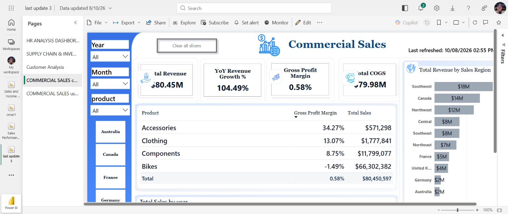
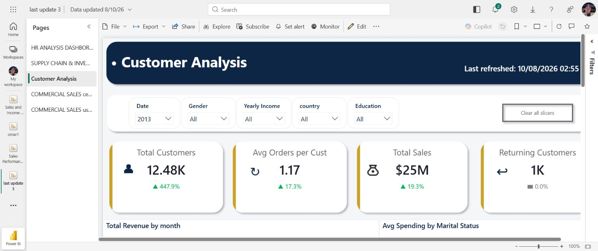

# Enterprise Operations Analytics | Power BI

An executive-ready Power BI portfolio project built with the Adventure Works training dataset. The report converts sales, customer, workforce, and inventory data into role-oriented views for commercial and operational decision-making.

## Portfolio scope

This public repository contains the two strongest, publication-ready views from the report:

1. **Commercial Sales** — revenue, cost, margin, product-category performance, and sales-region analysis.
2. **Customer Analysis** — customer base, order frequency, returning customers, customer segmentation, and geographic performance.

The HR and Supply Chain pages were reviewed during QA. HR is intentionally excluded from the public showcase until its headcount definitions are reconciled; Supply Chain is retained as a future enhancement rather than presented as a finished portfolio page.

## Data and model

- **Dataset:** Adventure Works training data; no confidential business data is included in this repository.
- **Modeling:** star-schema-oriented semantic model using date, customer, product, territory, employee, and fact tables.
- **Core facts:** Internet Sales and Product Inventory.
- **Dimensions:** Date, Customer, Product, Sales Territory, and Human Resources.
- **Transformation:** Power Query was used for data preparation, typing, shaping, and model-ready outputs.
- **Analysis:** DAX measures provide filter-aware KPIs and business ratios.

The original `.pbix` is not uploaded because it contains the embedded model and report definition. The repository focuses on the portfolio evidence: screenshots, methodology, measure documentation, and insights.

## Key measures

| Measure | Business meaning |
|---|---|
| Total Revenue | Revenue in the active filter context. |
| Total COGS | Cost of goods sold used to assess cost pressure. |
| Gross Profit Margin | Profitability ratio after cost of goods sold. |
| YoY Revenue Growth % | Year-over-year change in revenue. |
| Total Customers | Distinct customers in the selected context. |
| Avg Orders per Customer | Average order frequency across customers. |
| Returning Customers | Customers with repeat purchasing activity. |
| Avg Spending | Average customer spend by selected segment. |

See [`docs/measure-catalog.md`](docs/measure-catalog.md) for the curated measure catalog and [`docs/data-model-and-process.md`](docs/data-model-and-process.md) for the delivery process.

## Verified headline insights

- Commercial Sales reports **$80.45M revenue**, **$79.98M COGS**, and **0.58% gross profit margin** in the current unfiltered view.
- **Bikes generate $66.30M**, approximately **82.4% of total revenue**, while the displayed category margin is **-1.49%**. This points to a concentration and profitability risk that deserves management attention.
- The report identifies **Southwest as the strongest region at approximately $18.5M**, while Australia is the weakest market in the current view.
- In the Customer Analysis page with **2013 selected**, the report shows **12.48K customers**, **1.17 average orders per customer**, **$25M total sales**, and approximately **1K returning customers**.

These are portfolio examples from training data, not claims about a real company.

## QA note

During review, the Customer Analysis detail table displayed the same `$24.637M` revenue value for multiple customer rows. The HR page also showed a reconciliation issue between the 290-employee KPI and the gender breakdown. These visuals are therefore not used as final decision insights until their filter context and distinct-count definitions are corrected.

## Screenshots

### Commercial Sales

### Customer Analysis

## Tools

Power BI · Power Query · DAX · Star-schema modeling · KPI design · Business analysis · Data quality review

## Author

Omar Alyamani — Data Analyst / BI Analyst

